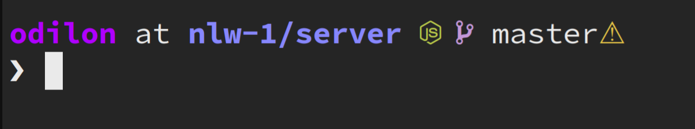

# Dino ZSH

> The zsh theme for developers :)



## Getting Started

### Prerequisites

- [Oh-my-zsh](https://github.com/ohmyzsh/ohmyzsh) should be installed

### Installation

Run the install script

```bash
./install
```
Then edit your .zshrc

```bash
ZSH_THEME="dino"
```

### Language suport

- Go

- Flutter

- NodeJS

- Lua

- Vim

- Python

- Java


### Contributing
Pull requests are welcome. For major changes, please open an issue first to discuss what you would like to change.

Please make sure to update tests as appropriate.

## License
[MIT](https://choosealicense.com/licenses/mit/)


